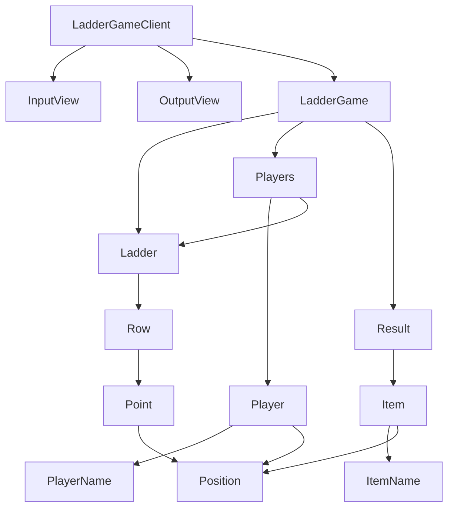

# 기능 목록

# 클래스

# 기능 목록

## PlayerName

- [x] 이름은 5글자를 넘길 수 없다.
- [x] 이름은 공백일 수 없다.
- [x] 이름은 null 일 수 없다.
- [x] 이름은 all 일 수 없다.

## Position

- [x] 위치는 0보다 작을 수 없다.
- [x] 같은 인덱스로 여러번 호출해도 같은 객체를 반환한다.

## ItemName

- [x] 이름은 5글자를 넘길 수 없다.
- [x] 이름은 공백일 수 없다.
- [x] 이름은 null 일 수 없다.

## Player

- [x] 플레이어는 이름을 가진다.
- [x] 플레이어는 위치를 가진다.

## Item

- [x] 아이템은 이름을 가진다.
- [x] 아이템은 위치를 가진다.

## Point

- [x] 왼쪽이 연결됨, 오른쪽이 연결됨, 연결안됨을 가진다.
- [x] 포지션을 연결된 여부에 따라 옮길 책임을 갖는다

## Row

- [x] 포인트들을 가진다.
- [x] 포인트들을 생성하는 책임을 갖는다.

## Ladder

- [x] 행들을 가진다.
- [x] 행들을 생성하는 책임을 갖는다.

## Players

- [x] 플레이어들을 가지는 일급 컬렉션의 역할

## Items

- [x] 아이템들을 가지는 일급 컬렉션의 역할

## LadderGame

- [x] 결과를 계산해주고, 조합하는 클래스의 역할을 한다

## LadderGameClient

- [x] 게임을 실행하는 클라이언트
- [x] all 과 같은 예약어를 입력받으면 게임을 종료한다.

## InputView

- [x] 플레이어 이름을 입력받는다.
- [x] 사다리 높이를 입력받는다.
- [x] 아이템 이름을 입력받는다.
- [x] 결과를 보고 싶은 플레이어 이름을 입력받는다.

## OutputView

- [x] 사다리를 출력한다.
- [x] 결과를 출력한다.

# 질문

- Dto 나, LadderGame 같은 클라이언트와, 게임이 동시에 알아야 하는 경우에 패키지가 너무 애매하게 느껴집니다. 어디에 두어야 할까요?
- 또 LadderGame 과 LadderGameImpl 이 같은 위치에 존재하게 되는 것 같은데요 이런 경우에는 어떻게 해야할까요?
- 이런 식으로 구조를 나누어 보는 것도 괜찮은 것 같긴 하지만, 너무 오버엔지니어링인 느낌이 들긴 하는데요 혹시 어떻게 생각하시는지 궁금합니다
- 한 패키지 안에 너무 많은 클래스가 존재하게 되는 것 같은데요 이런 경우에는 어떻게 해야할까요?
  이를 해결하기 위해서 ladder, player, item 같은 패키지를 두고, 관리하려고 했지만, 공통 의존성이 있는 부분이 있어서 하지 못했는데요 어떤 방식으로 패키지를
  분리하는 것이 좋을지 궁금합니다
- Item 클래스의 책임이 너무 애매해지는 느낌이 있는데요. 이런 경우에도 이 클래스를 두는 쪽이 좋아보이시나요?

# java-ladder

사다리 타기 미션 저장소

## 우아한테크코스 코드리뷰

- [온라인 코드 리뷰 과정](https://github.com/woowacourse/woowacourse-docs/blob/master/maincourse/README.md)
