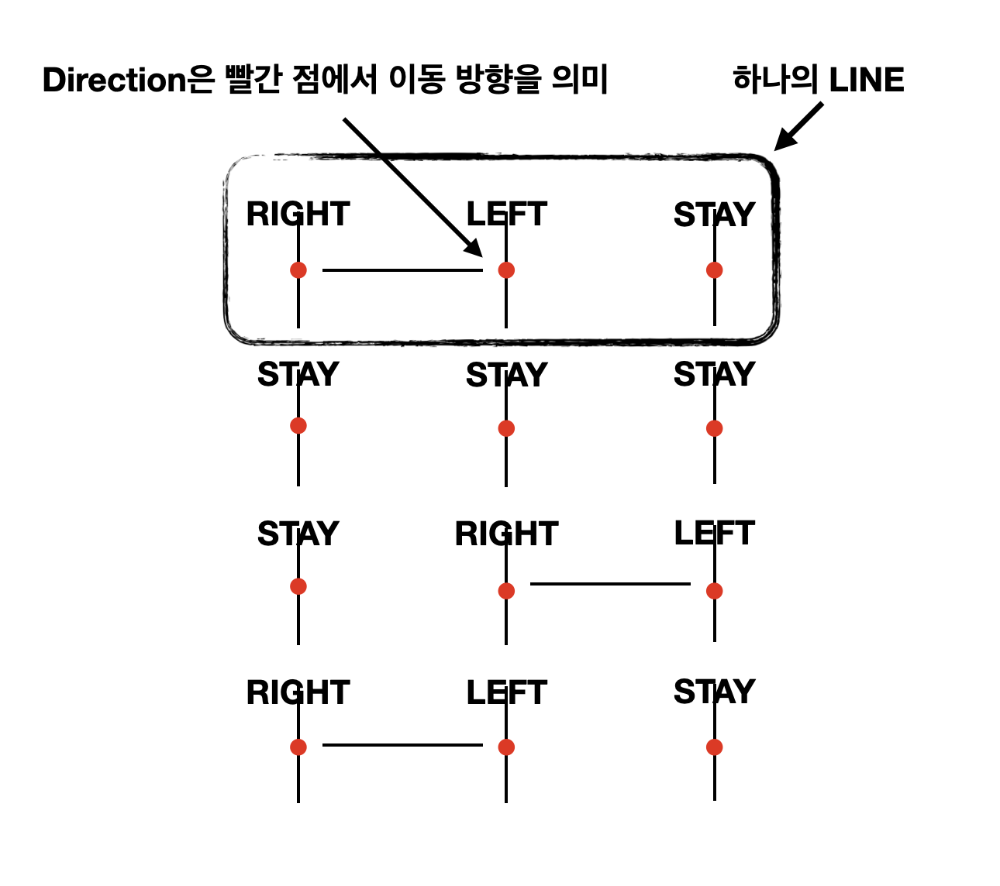

# java-ladder

사다리 타기 미션 저장소

## 우아한테크코스 코드리뷰

- [온라인 코드 리뷰 과정](https://github.com/woowacourse/woowacourse-docs/blob/master/maincourse/README.md)

## 개요

해당 저장소는 사다리 게임을 구현한 저장소입니다. `n`명의 플레이어 이름과 `n`개의 실행 결과와 높이 `m`을 입력하면 사다리가 생성됩니다.

결과 확인을 위해서는 플레이어 이름을 입력해야 합니다. 모든 플레이어의 결과를 확인할 수 있습니다.

결과 출력 후 게임은 종료됩니다.

입력 예외에 대한 재시도는 5회까지만 가능합니다. 재시도할 수 없으면 게임이 종료됩니다.

## 세부사항

플레이어

- 플레이어는 여러 명 존재할 수 있다.
    - [x] [제한사항] 플레이어는 2명 이상, 10명 이하만 가능하다.
    - [x] [제한사항] 플레이어의 이름은 중복될 수 없다.
- 플레이어는 이름을 가진다.
    - [x] [제한사항] 이름은 영문자만 가능하다.
    - [x] [제한사항] 이름은 최대 5글자까지 가능하다.

사다리



- 선들의 집합이다.
    - [x] [제한사항] 높이는 2 이상, 10 이하만 가능하다.
    - [x] 선은 방향들의 집합이다.
        - [x] 왼쪽, 오른쪽, 정지를 가진다.
        - [x] 방향은 랜덤으로 정해진다.
        - [x] 위치에 알맞은 방향으로 이동시킨다.
- [x] 사다리를 탄다.

당첨 항목

- 당첨 항목은 여러 개 존재할 수 있다.
    - [x] [제한사항] 당첨 항목의 개수는 플레이어 수와 같다.
    - [x] [제한사항] 당첨 항목은 공백이 될 수 없다.
    - [x] [제한사항] 당첨 항목은 최대 5글자까지 가능하다.
- [x] 위치에 알맞은 당첨 항목을 반환한다.

결과

- [x] 사다리 결과를 생성한다.
- [x] 결과를 확인할 수 있는 대상인지 확인한다.
- [x] 대상의 단일 결과를 반환한다.

재시도

- [x] 재시도 가능 여부를 확인한다.
- [x] 재시도 횟수를 감소시킨다.

입력

- [x] 참여할 플레이어들의 이름을 입력한다.
  ```text
  참여할 사람 이름을 입력하세요. (이름은 쉼표(,)로 구분하세요)
  pobi,honux,crong,jk
  ```
- [x] 실행 결과를 입력한다.
  ```text
  실행 결과를 입력하세요. (결과는 쉼표(,)로 구분하세요)
  꽝,5000,꽝,3000
  ```
- [x] 최대 사다리 높이를 입력한다.
  ```text
  최대 사다리 높이는 몇 개인가요?
  5
  ```
- [x] 결과 확인 대상을 입력한다.
    - 단일 대상
      ```text
      결과를 보고 싶은 사람은?
      pobi
      ```
    - 전체 대상
      ```text
      결과를 보고 싶은 사람은?
      pobi
      ```

출력

- [x] 사다리 결과를 출력한다.
  ```text
  사다리 결과
  
  pobi  honux crong   jk
  |-----|     |-----|
  |     |-----|     |
  |-----|     |     |
  |     |-----|     |
  |-----|     |-----|
  꽝    5000  꽝    3000
  ```
- [x] 실행 결과를 출력한다.
    - 단일 결과
      ```text
      실행 결과
      꽝
      ```
    - 전체 결과
      ```text
      실행 결과
      pobi : 꽝
      honux : 3000
      crong : 꽝
      jk : 5000
      ```
