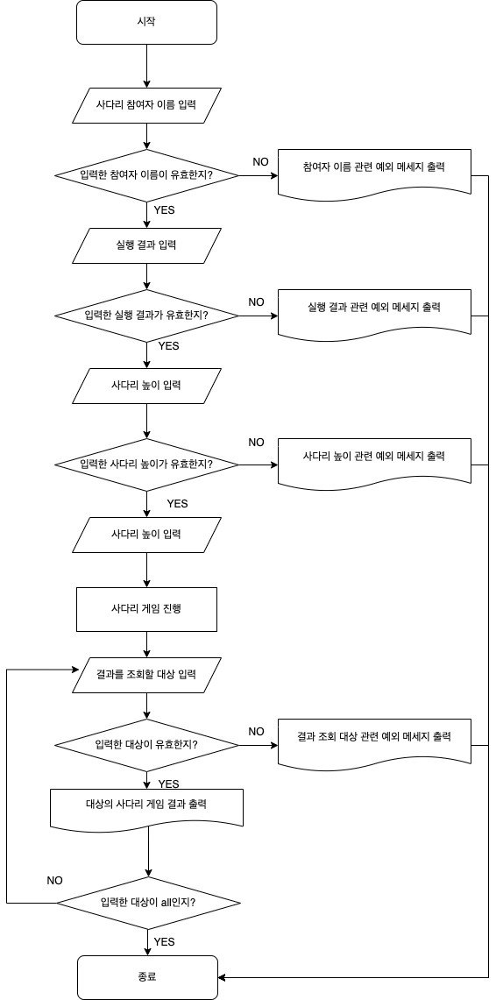

# java-ladder

사다리 타기 미션 저장소

## Flow Chart

## 기능 정의

- Height : 입력한 사다리의 높이를 관리하는 원시 값을 포장한 클래스
  - 기능
    - [x] 현재 사다리 높이와 생성해야 하는 사다리 높이를 비교해 사다리를 모두 생성했는지 여부 확인
  - 예외 처리
    - [x] 사다리의 높이가 1 미만인 경우
- Name : 입력한 참가자 이름을 관리하는 원시 값을 포장한 클래스
  - 기능
    - [x] 이름 조회
    - [x] 동일한 Name에 대해 참가자 이름(name)을 기준으로 동등성 확인
    - [x] 문자열에 대해 참가자 이름(name)을 기준으로 동등성 확인
  - 예외 처리
    - [x] 이름의 길이가 1 ~ 5가 아닌 경우
    - [x] 이름이 공백인 경우
- Names : Name을 관리하는 일급 컬렉션
  - 기능
    - [x] 특정 순서(인덱스)의 참가자 조회
    - [x] 참가자 인원 수 조회
    - [x] 참가자 이름으로 참가자 순서(인덱스) 조회
  - 예외 처리
    - [x] 관리할 컬렉션(Name)이 유효한 값이 아닌 경우(null)
    - [x] 참가자의 인원 수가 2명 미만인 경우
    - [x] 중복된 참가자 이름이 있는 경우
    - [x] 특정 순서(인덱스)를 기반으로 조회 시 관리하고 있는 컬렉션의 인덱스를 벗어난 값을 전달한 경우
    - [x] 참가자 이름으로 인덱스 조회 시 없는 참가자 이름을 전달한 경우
- Path : 사다리의 각 칸에 대한 이동 여부를 관리하는 enum, 사다리의 각 칸을 의미
  - 기능
    - [x] 첫 번째 사다리 경로 생성
    - [x] 두 번째 이후의 사다리 경로 생성
    - [x] 사다리 로그 조회
  - 예외 처리
    - [x] 입력한 boolean에 따른 올바른 Path를 찾지 못하는 경우
- Line : Path를 관리하는 일급 컬렉션, 사다리의 각 줄을 의미
  - 기능
    - [x] Path 컬렉션 조회
    - [x] 자기 자신과 다른 Line이 관리하는 Path 컬렉션의 크기가 같은지 비교
  - 예외 처리
    - [x] 관리할 컬렉션(Path)이 유효한 값이 아닌 경우(null)
    - [x] 주입된 Path 컬렉션의 길이가 1 미만인 경우
    - [x] 주입된 Path 컬렉션에서 연속된 Path가 모두 건널 수 있는 경로인 경우
- Ladder : Line을 관리하는 일급 컬렉션, 사다리를 의미
  - 기능
    - [x] Line 컬렉션 조회
  - 예외 처리
    - [x] 관리할 컬렉션(Line)이 유효한 값이 아닌 경우(null)
    - [x] Line 컬렉션의 길이가 1 미만인 경우
    - [x] Line 컬렉션의 Path 컬렉션의 길이가 모두 일치하지 않는 경우
- LadderMaker : Ladder를 관리하는 클래스
  - 기능
    - [x] 사다리 생성
    - [x] 사다리 조회
  - 예외 처리
    - [x] 사다리를 생성하기 전 사디리를 조회하는 경우
- LadderResult : 사다리 게임의 실행 결과를 관리하는 원시 값을 포장한 클래스
  - 기능
    - [x] 사다리 실행 결과 조회
  - 예외 처리
    - [x] 주입된 사다리 실행 결과가 null 이거나 공백인 경우
- Direction : 사다리 게임 진행을 위해 진행하고 있는 커서를 이동시키는 enum
  - 기능
    - [x] 현재 조건에 맞는 Direction 조회
    - [x] 사다리 게임 진행을 위해 현재 Position을 Direction의 offset을 더해 이동하는 기능
- LadderGame : 사다리 게임을 진행하고 사다리 게임의 전체 실행 결과를 관리하는 클래스
  - 기능
    - [x] 사다리 게임을 진행하고 사다리 게임의 전체 실행 결과를 관리
    - [x] 사다리 게임의 결과를 참가자 이름으로 조회
    - [x] 서다리 게임의 전체 결과 조회
- LadderGameCommand : 사다리 게임의 종료 명령어를 판별하는 enum
  - 기능
    - [x] 사다리 게임을 계속 실행하는지 여부를 판단하는 기능
- PassGenerator : 사다리의 칸을 건널 수 있는지 여부를 생성하는 인터페이스
  - 기능
    - [x] 사다리의 칸이 건널 수 있는지 여부를 반환하는 기능

## 입력 정의

- [x] 참가자 이름 입력
  - 예외 처리
    - [x] 유효한 구분자가 포함되지 않은 경우
- [x] 사다리 높이 입력
  - 예외 처리
    - [x] 입력이 숫자가 아닌 경우
- [x] 사다리 결과 입력
  - 예외 처리
    - [x] 유효한 구분자가 포함되지 않은 경우
- [x] 사다리 결과를 출력할 참가자 이름 입력
- 공통 예외 처리
  - [x] 공백을 입력했을 경우

## 출력 정의

- [x] 입력 안내 문구 출력
- [x] 생성된 사다리 출력
- [x] 조회한 사다리 결과 출력
