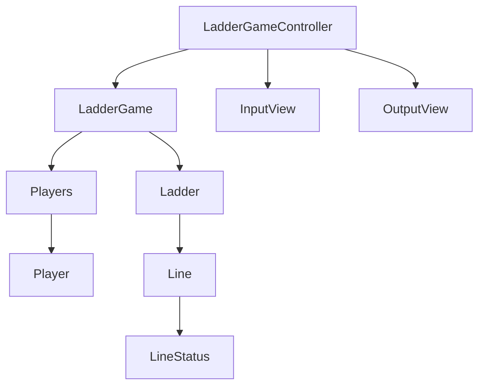

# java-ladder

사다리 타기 미션 저장소

## 우아한테크코스 코드리뷰

- [온라인 코드 리뷰 과정](https://github.com/woowacourse/woowacourse-docs/blob/master/maincourse/README.md)

### 다이어그램

### 참여자

- [ ] 참여자는 이름을 가진다.
  - [ ] 이름은 1자 이상, 5자 이하의 길이를 가진다.
  - [ ] 이름의 앞뒤 공백을 허용하지 않는다.

### 사다리

- [ ] 사다리는 높이를 가진다.
- [ ] 사다리 가로 라인을 가진다.
- [ ] 사다리 가로 라인이 겹치지 않도록 해야 한다.

### 입력

- [ ] 사람 이름은 쉼표(,)를 기준으로 구분하여 입력받는다.
- [ ] 최대 사다리 높이를 입력받는다.

### 출력

- [ ] 사람 이름을 5자 기준으로 출력하기 때문에 사다리 폭도 넓어져야 한다.

