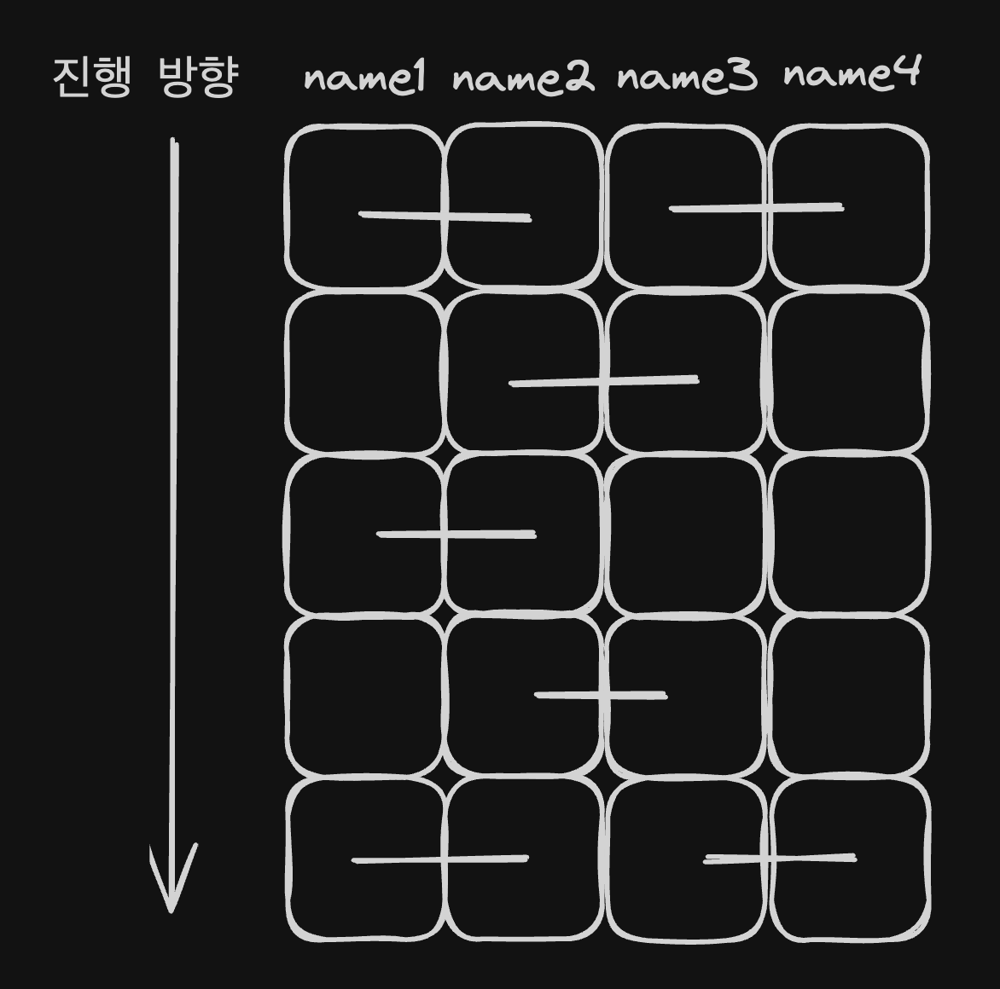
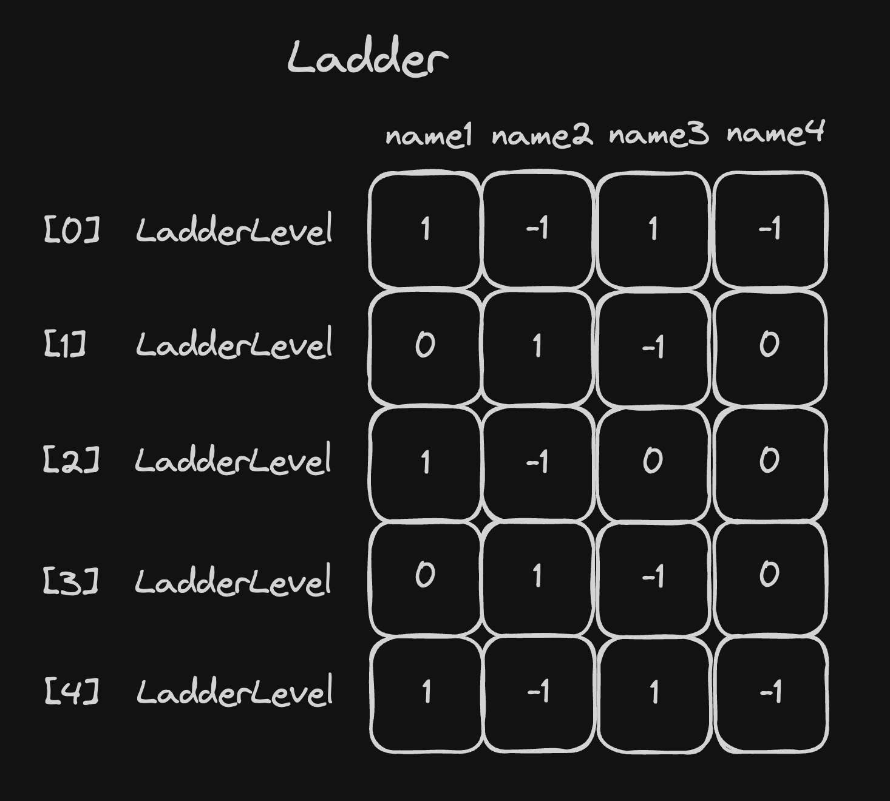

# java-ladder

사다리 타기 미션 저장소

## 기능 목록

### 입력

- [X] 이름들
    - [X] 예외
        - [X] 이름이 1-5자 범위를 벗어난 경우
        - [X] 이름이 중복된 경우
- [ ] 실행 결과
    - [ ] 예외
        - [ ] 사람 수와 결과 수가 다른 경우
- [X] 높이
    - [X] 예외
        - [X] 높이가 자연수가 아닌 경우
- [ ] 결과를 보고 싶은 사람
    - [ ] 예외
        - [ ] 입력된 이름이 존재하지 않는 경우

### 로직

- [X] 사다리 생성
    - [X] 가로줄은 무작위로 생성
- [X] 예외가 발생할 경우 다시 입력
- [ ] 사람을 입력하면 그 사람의 결과를 반환
    - [ ] all을 입력하면 모두의 결과를 반환

### 출력

- [X] 이름들
- [X] 사다리
- [ ] 실행 결과

## 예시

```
참여할 사람 이름을 입력하세요. (이름은 쉼표(,)로 구분하세요)
pobi,honux,crong,jk

최대 사다리 높이는 몇 개인가요?
5

실행결과

pobi  honux crong   jk
    |-----|     |-----|
    |     |-----|     |
    |-----|     |     |
    |     |-----|     |
    |-----|     |-----|

```

## 구현 아이디어

예시의 실행 결과를 그래프로 도식화하면 다음과 같습니다.



그래프를 행렬로 표현했습니다.



각 칸은 세로줄을 의미하고, 1과 -1의 쌍은 가로줄을 의미합니다.

즉 1은 오른쪽 방향을, -1은 왼쪽 방향을, 0은 방향이 없음을 의미합니다.

## 리팩토링 목록

- [X] People 객체만으로 충분하므로 Person 삭제
- [X] 인스턴스 변수를 private으로 변경
- [X] 원시 자료형을 래퍼 클래스로 변경
    - [X] Height 생성
- [X] 매직넘버를 상수로 변경
- [X] 테스트 개선
    - [X] LadderLevelTest
        - [X] 생성 테스트 추가
        - [X] 테스트케이스 생성 메서드 들여쓰기 제거
        - [X] 테스트명 변경
    - [X] LadderTest
        - [X] 생성 테스트 추가
        - [X] 테스트명 변경
    - [X] PeopleTest
        - [X] count 테스트 추가
        - [X] 테스트명 변경
    - [X] HeightTest
        - [X] 테스트명 변경
- [X] Person 추가
- [X] Person -> Player, People -> Players 로 변경
