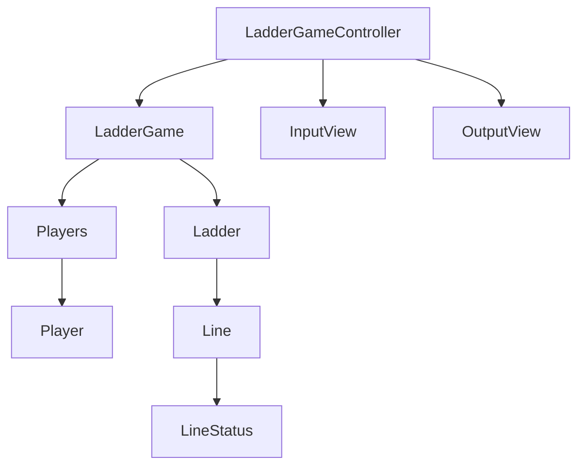

# java-ladder

사다리 타기 미션 저장소

## 우아한테크코스 코드리뷰

- [온라인 코드 리뷰 과정](https://github.com/woowacourse/woowacourse-docs/blob/master/maincourse/README.md)

### 다이어그램

### 참가자

- [x] 참가자는 이름을 가진다.
    - [x] 이름은 1자 이상, 5자 이하의 길이를 가진다.
- [x] 참가자는 최소 2명 이어야 한다.
- [x] 참가자들의 이름은 중복될 수 없다.

### 사다리

- [x] 사다리는 높이를 가진다.
- [x] 사다리 가로 라인을 가진다.
    - [x] 사다리 가로 라인의 상태가 연속으로 `연결됨` 상태일 수 없다.
- [x] 각각의 가로 라인은 상태를 가진다.
    - [x] 연결됨, 연결되지 않음으로 구분된다.

### 입력

- [x] 사람 이름은 쉼표(,)를 기준으로 구분하여 입력받는다.
- [x] 이름의 앞뒤 공백을 제거한다.
- [x] 최대 사다리 높이를 입력받는다.

### 출력

- [x] 사람 이름을 5자 기준으로 출력하기 때문에 사다리 폭도 넓어져야 한다.

