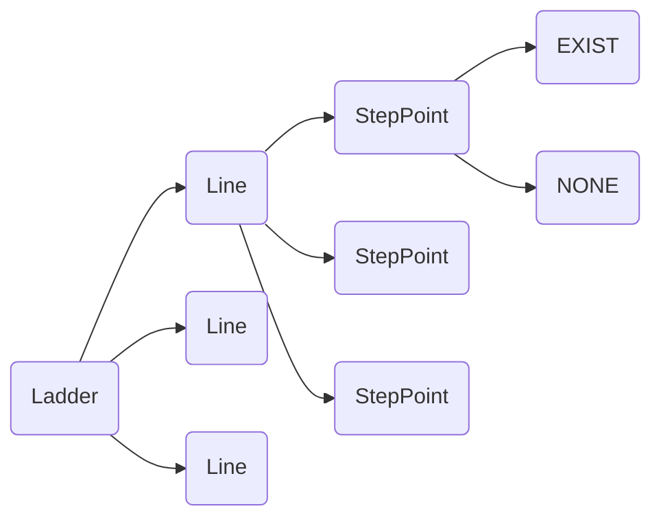
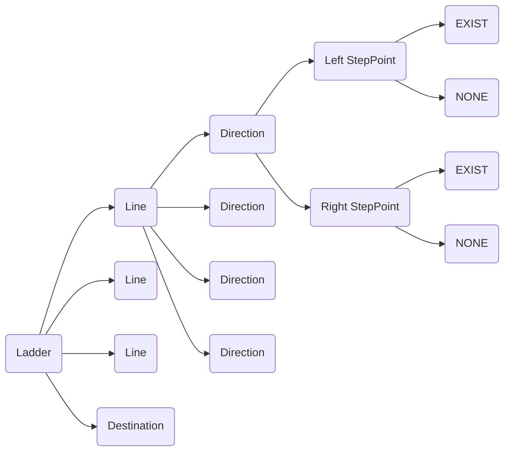

# java-ladder

사다리 타기 미션 저장소

## 우아한테크코스 코드리뷰

- [온라인 코드 리뷰 과정](https://github.com/woowacourse/woowacourse-docs/blob/master/maincourse/README.md)

## 미션 명세

### 도메인 요소

- 사다리 게임 참여자
    - 이름
- 사다리
    - (높이)개의 가로 라인
        - 높이는 1 이상이다.
        - (폭)개의 방향
            - 폭은 1 이상이다.
            - 폭은 (참여자 수)이다.
            - 각 방향은 왼쪽, 오른쪽의 디딤대 좌표값을 가진다.
    - 종착지
        - (참여자 수) 만큼의 개수를 가진다.

### 기능 목록

#### UI 기능

- 입력 기능
    - [x] 사다리 게임에 참여하는 사람의 이름을 입력받는다.
        - [x] 사람 이름을 쉼표를 기준으로 구분한다.
    - [x] 사다리의 높이를 입력받는다.
    - [ ] 사다리 종착지 결과를 입력받는다.
        - [ ] 종착지 결과를 쉼표를 기준으로 구분한다.
    - [ ] 결과를 보고 싶은 참여자 이름을 입력받는다.

- 출력 기능
    - [ ] 전달받은 참여자에 해당하는 종착지 결과를 출력한다.
        - [ ] `all`을 입력받으면 모든 참여자 별 종착지 결과를 출력한다.
    - [x] 사다리 게임 결과를 출력한다.
        - [x] 사람 이름을 같이 출력한다.
        - [x] 사다리의 크기에 맞춰 이름 간격을 조절한다.
        - [ ] 사다리 종착지 결과를 같이 출력한다.
        - [ ] 사다리의 크기에 맞춰 사다리 종착지 결과를 조절한다.

#### 도메인 기능

- 사다리 게임 참여자
    - [x] 이름을 가질 수 있다.
    - [x] 이름은 최대 5글자이다.
- 사다리 게임 참여자들
    - [x] 참여자는 1명 이하일 수 없다.
- 사다리 게임
    - [x] 사다리를 생성한다.
    - [x] 참여자가 2명 이상이어야 생성 가능하다.
    - [x] 참여자가 2명 미만이면 예외를 던진다.
- 사다리
    - [x] 라인들을 가진다.
    - [x] 종착지를 가진다.
        - [x] 결과의 개수가 참여자 수와 같지 않으면 예외를 던진다.
        - [ ] 출발지에 따른 종착지 결과를 구한다.
- 사다리 라인
    - [x] 라인은 주어진 폭 만큼의 방향을 가진다.
    - [x] 라인의 주어진 폭은 1 이상이어야 한다.
    - [x] 주어진 개수만큼의 사다리 방향을 주어진 생성방식에 따라 생성한다.
    - [x] 맨 왼쪽, 맨 오른쪽 디딤대는 무조건 존재하지 않는다.
    - [x] 주어진 위치에서 이동할 방향을 반환한다.
- 사다리 라인들
    - [x] 주어진 높이만큼의 라인을 가진다.
    - [x] 주어진 높이는 1 이상이어야 한다.
    - [x] 출발지에 따른 종착지의 위치를 구한다.
        - [x] 라인의 위치에서 받은 방향에 따라 위치를 옮기거나 옮기지 않는다.
        - [x] 모든 가로 라인에서 이를 반복한다.
- 디딤대 좌표값 랜덤 생성기
    - [x] 랜덤하게 존재 유/무를 결정하되, 연속되지 않도록 생성한다.
- 디딤대 좌표값
    - [x] 디딤대 좌표값은 각 위치의 디딤대 존재 유/무로 표현된다.
    - [x] 같은 라인의 두 좌표값에 모두 디딤대가 존재하면, 연속된 것이다.
- 사다리 방향
    - [x] 사다리 방향은 왼쪽, 오른쪽 두 개의 디딤대 좌표값을 가진다.
    - [x] 양쪽 디딤대 좌표값의 상태에 따라서 이동할 방향을 반환한다. (왼쪽, 오른쪽, 아래)
    - [x] 양쪽 디딤대가 연속될 경우 예외를 던진다.
    - [x] 각 방향은 현재 위치값을 이용해 다음 위치값을 계산해 반환한다.
        - [x] 아래 방향이면 (현재 위치)
        - [x] 왼쪽 방향이면 (현재 위치 - 1)
        - [x] 오른쪽 방향이면 (현재위치 + 1)
- 사다리 종착지
    - [x] 전달받은 개수만큼의 결과를 가진다.
    - [x] 전달받은 위치에 해당하는 결과를 반환한다.
        - [x] 개수를 넘어서는 위치를 전달받은 경우 예외를 던진다.

### 2단계 기능 추가로 인한 설계 변경사항

실행 결과를 조회하는 기능 추가에 따라 클래스 설계를 아래와 같이 변경함.

#### 객체 포함관계 다이어그램

- 1단계

- 2단계 (구현 예정)

