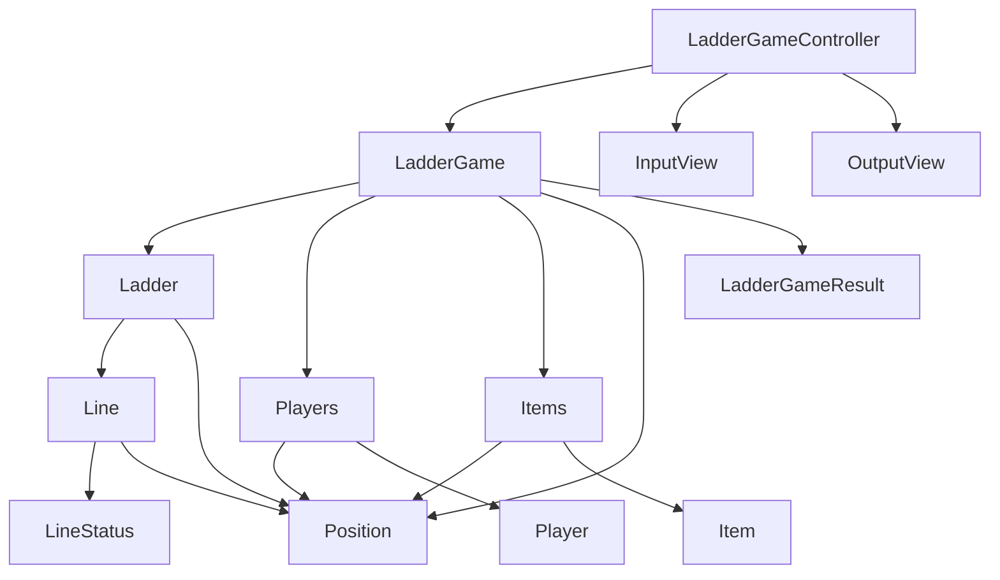

# java-ladder

사다리 타기 미션 저장소

## 우아한테크코스 코드리뷰

- [온라인 코드 리뷰 과정](https://github.com/woowacourse/woowacourse-docs/blob/master/maincourse/README.md)

### 다이어그램

### 참가자

- [x] 참가자는 이름을 가진다.
    - [x] 이름은 1자 이상, 5자 이하의 길이를 가진다.
        - [x] 이름이 없거나, 5자를 초과하는 경우 예외를 던진다.
    - [x] 참가자들의 이름은 중복될 수 없다.
        - [x] 중복된 이름이 존재하는 경우 예외를 던진다.
- [x] 참가자는 최소 2명 이어야 한다.
    - [x] 참가자가 1명 이하인 경우 예외를 던진다.
- [x] 참가자는 최대 20명 이어야 한다.
    - [x] 참가자가 20명을 초과하는 경우 예외를 던진다.
- [x] 참가자는 위치를 가진다.
    - [x] 위치 값은 0부터 시작한다.

### 아이템(실행결과)

- [x] 아이템은 이름을 가진다.
    - [x] 이름 길이는 참가자의 이름과 동일하게 1자 이상, 5자 이하의 길이를 가진다.
- [x] 아이템은 참가인원과 동일한 개수가 있어야 한다.
- [x] 아이템은 위치를 가진다.
    - [x] 위치 값은 0부터 시작한다.

### 사다리 게임

- [x] 사다리는 높이를 가진다.
    - [x] 높이는 1이상, 100이하의 값이어야 한다.
- [x] 사다리의 높이만큼 가로 라인을 가진다.
    - [x] 각각의 가로 라인은 `사다리 게임 참가자 - 1` 너비만큼의 연결 상태를 가진다.
        - [x] `사다리 게임 참가자 - 1` 만큼의 위치값을 가지고 각 위치에 연결상태가 존재한다.
        - [x] 연결 상태는 연결됨, 연결되지 않음으로 구분된다.
    - [x] 가로 라인의 연결 상태가 연속으로 `연결됨` 일 수 없다.
- [x] 사다리 게임을 진행한다.
- [x] 모든 참가자에 대한 결과를 반환한다.

### 입력

- [x] 참가자 이름은 쉼표(,)를 기준으로 구분하여 입력받는다.
    - [x] 이름의 앞뒤 공백을 제거한다.
- [x] 결과명은 쉼표(,)를 기준으로 구분하여 입력받는다.
    - [x] 결과명의 앞뒤 공백을 제거한다.
- [x] 최대 사다리 높이를 입력받는다.
    - [x] 1보다 작은 값을 입력 받거나, 100보다 큰 값을 입력받는 경우 예외를 던진다.
- [x] 실행결과를 보고 싶은 참가자명을 입력받는다.

### 출력

- [x] 가장 긴 사람 이름을 기준으로 사다리 폭이 넓어진다. 예) 가장 긴 사람이름 5, 사다리 폭 5
- [x] 실행 결과를 이용하여 해당 참가자에 대한 결과를 출력한다.

