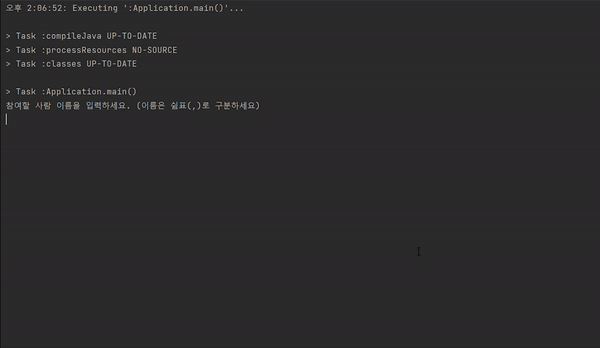

<p align="center">
    
</p>

# 미션 - 사다리 게임

###### `우아한테크코스 사다리 게임 미션을 진행한 저장소 입니다.`



## 🔍 프로그램 소개
#### 사용자의 입력으로부터 사다리 게임을 생성하고, 실행하는 프로그램입니다.


## 🚀 사용자 유의 사항
`사용자로부터 사다리 게임에 참여할 사람의 이름과 내기 목록, 사다리의 높이를 입력받습니다.`
```
- 사다리 게임 참여자의 이름은 5글자 이하이다.
- 중복된 이름은 허용하지 않는다.
- 'all'이라는 이름은 허용하지 않는다.
- 사다리 게임 참여자는 2명 이상 100명 이하이다.
- 각 내기 목록은 5글자 이하이다.
- 참여자 수와 내기 목록의 수가 일치해야 한다.
- 이름과 내기 목록은 콤마(,)로 구분한다.
- 이름과 내기 목록은 콤마(,)를 제외한 특수문자를 모두 허용한다.
- 사다리의 높이는 1이상을 입력한다.
- 사다리의 높이는 10000 이하다.
- 결과를 보고싶은 사람의 이름 혹은, all을 입력하여 결과를 볼 수 있다.
- all을 통해 모든 결과를 확인하면 프로그램이 종료된다.
```

