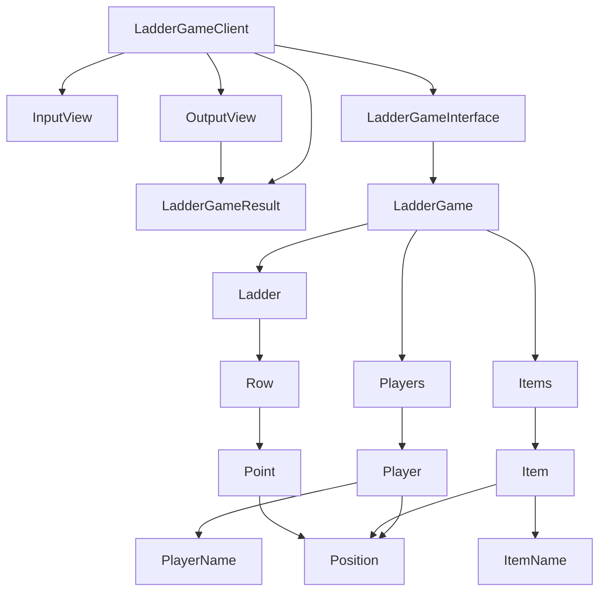

# 기능 목록

# 클래스

# 기능 목록

## PlayerName

- [x] 이름은 5글자를 넘길 수 없다.
- [x] 이름은 공백일 수 없다.
- [x] 이름은 null 일 수 없다.
- [x] 이름은 all 일 수 없다.

## Position

- [x] 위치는 0보다 작을 수 없다.
- [x] 같은 인덱스로 여러번 호출해도 같은 객체를 반환한다.

## ItemName

- [x] 이름은 5글자를 넘길 수 없다.
- [x] 이름은 공백일 수 없다.
- [x] 이름은 null 일 수 없다.

## Player

- [ ] 플레이어는 이름을 가진다.
- [ ] 플레이어는 위치를 가진다.

## Item

- [ ] 아이템은 이름을 가진다.
- [ ] 아이템은 위치를 가진다.

## Point

- [ ] 왼쪽이 연결됨, 오른쪽이 연결됨, 연결안됨을 가진다.
- [ ] 포지션을 연결된 여부에 따라 옮길 책임을 갖는다

## Row

- [ ] 포인트들을 가진다.
- [ ] 포인트들을 생성하는 책임을 갖는다.

## Ladder

- [ ] 행들을 가진다.
- [ ] 행들을 생성하는 책임을 갖는다.

## Players

- [ ] 플레이어들을 가지는 일급 컬렉션의 역할

## Items

- [ ] 아이템들을 가지는 일급 컬렉션의 역할

## LadderGame

- 결과를 계산해주고, 조합하는 클래스의 역할을 한

## LadderGameResult

- [ ] 클라이언트가 저장해두는 느낌의 결과를 가진다

## LadderGameInterface

- [ ] 게임을 테스트하기 위해서 의존성을 분리하기 위한 인터페이스

## LadderGameClient

- [ ] 게임을 실행하는 클라이언트
- [ ] all 과 같은 예약어를 입력받으면 게임을 종료한다.

## InputView

- [ ] 플레이어 이름을 입력받는다.
- [ ] 사다리 높이를 입력받는다.
- [ ] 아이템 이름을 입력받는다.
- [ ] 결과를 보고 싶은 플레이어 이름을 입력받는다.

## OutputView

- [ ] 사다리를 출력한다.
- [ ] 결과를 출력한다.

# 질문

- 도메인을 패키지 단위로 분리했을 때, ladder, player, item 이 모두 의존하고 있는 공통의존성은 어디에 두어야 할까요?
  ex) Position
- Player, Item 같은 객체는 책임이 애매하게 느껴질 수 있는데, 객체로서의 의미가 있나요?

# java-ladder

사다리 타기 미션 저장소

## 우아한테크코스 코드리뷰

- [온라인 코드 리뷰 과정](https://github.com/woowacourse/woowacourse-docs/blob/master/maincourse/README.md)
