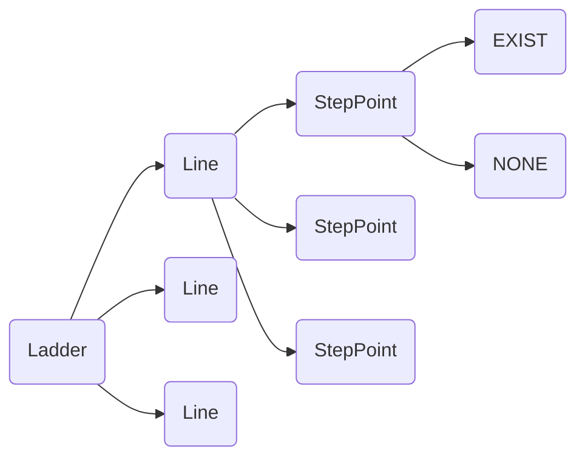
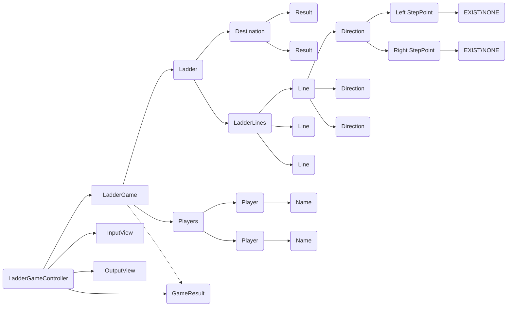

# java-ladder

사다리 타기 미션 저장소

## 우아한테크코스 코드리뷰

- [온라인 코드 리뷰 과정](https://github.com/woowacourse/woowacourse-docs/blob/master/maincourse/README.md)

## 미션 명세

### 도메인 요소

- 사다리 게임 참여자
    - 이름
- 사다리
    - (높이)개의 가로 라인
        - 높이는 1 이상이다.
        - (폭)개의 방향
            - 폭은 1 이상이다.
            - 폭은 (참여자 수)이다.
            - 각 방향은 왼쪽, 오른쪽의 디딤대 좌표값을 가진다.
    - 종착지
        - (참여자 수) 만큼의 개수를 가진다.

### 기능 목록

#### UI 기능

- 입력 기능
    - [x] 쉼표를 기준으로 문자열을 입력받는다.
        - [x] `예외` 입력값이 null이면 예외를 던진다.
    - [x] 자연수를 입력받는다.
        - [x] `예외` 입력값이 정수가 아니거나 0 이하이면 예외를 던진다.
    - [x] 사다리 게임에 참여하는 사람의 이름을 입력받는다.
        - [x] 사람 이름을 쉼표를 기준으로 구분한다.
        - [x] `예외`  사람 이름이 예약어(`all, q, ALL, Q`)와 일치하면 예외를 던진다.
    - [x] 사다리의 높이를 입력받는다.
    - [x] 사다리 종착지 결과를 입력받는다.
        - [x] 종착지 결과를 쉼표를 기준으로 구분한다.
    - [x] 결과를 보고 싶은 참여자 이름을 입력받는다.
        - [x] `Q/q`를 입력할 때까지 반복해서 입력받는다.

- 출력 기능
    - [x] 전달받은 참여자에 해당하는 종착지 결과를 출력한다.
        - [x] `all, ALL`을 입력받으면 모든 참여자 별 종착지 결과를 출력한다.
    - [x] 사다리 결과를 출력한다.
        - [x] 사람 이름을 같이 출력한다.
        - [x] 사다리의 크기에 맞춰 이름 간격을 조절한다.
        - [x] 사다리 종착지 결과를 같이 출력한다.
        - [x] 사다리의 크기에 맞춰 사다리 종착지 결과를 조절한다.

#### 도메인 기능

- 사다리 게임 참여자들
    - [x] `예외` 참여자가 2명 미만이면 예외를 던진다.
    - [x] `예외` 중복 이름이 존재하면 예외를 던진다.
- 사다리 게임 참여자
    - [x] 이름을 가질 수 있다.
        - [x] `예외` 이름이 5글자를 초과하면 예외를 던진다.
        - [x] `예외` 이름이 null 또는 빈문자열이면 예외를 던진다.

- 사다리 게임
    - [x] 사다리를 생성한다.
    - [x] 모든 참여자에 대한 결과를 계산한다.
        - [x] `예외` 사다리가 생성되지 않은 게임의 결과를 요청하면 예외를 던진다.
- 사다리
    - [x] 라인들을 가진다.
    - [x] 종착지를 가진다.
        - [x] 출발지에 따른 종착지 위치의 결과를 구해서 반환한다.
        - [x] `예외` 결과의 개수가 참여자 수와 같지 않으면 예외를 던진다.
- 사다리 라인들
    - [x] 주어진 높이만큼의 라인을 가진다.
    - [x] 주어진 높이는 1 이상이어야 한다.
        - [x] `예외` 높이가 1 미만이면 예외를 던진다.
    - [x] 출발지 위치에 따른 종착지의 위치를 구한다.
        - [x] 라인의 위치에서 받은 방향에 따라 위치를 옮기거나 옮기지 않는다.
        - [x] 모든 가로 라인에서 이를 반복한다.
- 사다리 라인
    - [x] 라인은 주어진 폭 만큼의 방향을 가진다.
    - [x] 라인의 주어진 폭은 1 이상이어야 한다.
        - [x] `예외` 폭이 1 미만이면 예외를 던진다.
    - [x] 주어진 개수만큼의 사다리 방향을 주어진 생성방식에 따라 생성한다.
        - [x] `예외` 디딤대가 연속으로 존재하면 예외를 던진다.
    - [x] 맨 왼쪽, 맨 오른쪽 디딤대는 무조건 존재하지 않는다.
    - [x] 주어진 위치에서 이동할 방향을 반환한다.
        - [x] `예외` 주어진 위치가 범위를 넘어서면 예외를 던진다.
- 사다리 방향
    - [x] 사다리 방향은 왼쪽, 오른쪽 두 개의 디딤대 좌표값을 가진다.
    - [x] 양쪽 디딤대 좌표값의 상태에 따라서 이동할 방향을 반환한다. (왼쪽, 오른쪽, 아래)
        - [x] `예외` 양쪽 디딤대가 연속될 경우 예외를 던진다.
    - [x] 각 방향은 현재 위치값을 이용해 다음 위치값을 계산해 반환한다.
        - [x] 아래 방향이면 (현재 위치)
        - [x] 왼쪽 방향이면 (현재 위치 - 1)
        - [x] 오른쪽 방향이면 (현재위치 + 1)
- 디딤대 좌표값 랜덤 생성기
    - [x] 랜덤하게 존재 유/무를 결정하되, 연속되지 않도록 생성한다.
- 디딤대 좌표값
    - [x] 디딤대 좌표값은 각 위치의 디딤대 존재 유/무로 표현된다.
    - [x] 같은 라인의 두 좌표값에 모두 디딤대가 존재하면, 연속된 것이다.
- 사다리 종착지
    - [x] 전달받은 개수만큼의 결과를 가진다.
    - [x] 전달받은 위치에 해당하는 결과를 반환한다.
        - [x] `예외` 개수를 넘어서는 위치를 전달받은 경우 예외를 던진다.
- 게임 결과
    - [x] 참여자 이름을 전달받아 해당 참여자에 대한 결과를 반환한다.
    - [x] 모든 결과를 반환한다.
    - [x] `예외` 참여자 이름에 대한 결과가 없을 경우 예외를 던진다.

### 2단계 기능 추가로 인한 설계 변경사항

실행 결과를 조회하는 기능 추가에 따라 클래스 설계를 아래와 같이 변경함.

#### 객체 포함관계 다이어그램

- 1단계

- 2단계

#### 2단계 리뷰 반영 리팩터링 목록

- [x] 모호한 네이밍 수정 (Result -> Item)
- [x] index 검증 로직 부정확한 예외 메시지 수정
- [x] index 검증에 대한 커스텀 예외 적용
- [x] 결과 검색 키워드 관련
    - [x] 다른 변수명, 메서드명과 통일하여 클래스명 SearchType으로 변경
        - [x] 컨트롤러에서만 사용되므로 패키지 이동
        - [x] keyword 대소문자 구분 없이 모두 처리 가능하게 만들기
        - [x] enum 클래스에서 검색유형에 해당하는 상수 확인하게 만들기
    - [x] 참여자의 이름이 all, q인 경우 검증 로직 추가
- [x] 도메인 로직 전체에서 참여자 이름, 결과 아이템 원시값 포장 사용하도록 하기
- [x] 부적절한 스트림 활용 수정하기
    - [x] map 생성 시 스트림만으로 처리하거나 일반 foreach 사용하기
    - [x] 참여자 인덱스 조회 로직 코드 단순화
- [ ] null 검증 대신 Optional 활용해보기 => ?
- [x] 뷰 사다리 결과 포맷 생성 로직에서 도메인 관련 코드 없애기
- [x] final 키워드 적용
- [x] 테스트 코드 중복코드, 가독성 개선
- [x] 빈 줄 컨벤션 어떻게 할지 정리
