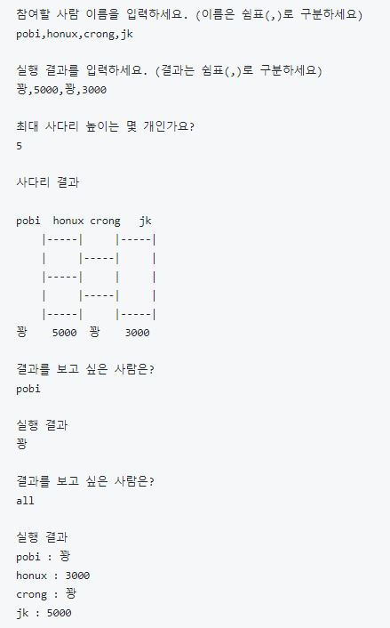

# java-ladder
사다리타기 미션 저장소

## 우아한테크코스 코드리뷰
* [온라인 코드 리뷰 과정](https://github.com/woowacourse/woowacourse-docs/blob/master/maincourse/README.md)

# TDD - 문자열 덧셈 계산기

## 기능 요구사항
- 쉼표(,) 또는 콜론(:)을 구분자로 가지는 문자열을 전달하는 경우 구분자를 기준으로 분리한 각 숫자의 합을 반환 (예: “” => 0, "1,2" => 3, "1,2,3" => 6, “1,2:3” => 6)
- 앞의 기본 구분자(쉼표, 콜론)외에 커스텀 구분자를 지정할 수 있다. 커스텀 구분자는 문자열 앞부분의 “//”와 “\n” 사이에 위치하는 문자를 커스텀 구분자로 사용한다. 예를 들어 “//;\n1;2;3”과 같이 값을 입력할 경우 커스텀 구분자는 세미콜론(;)이며, 결과 값은 6이 반환되어야 한다.
- 문자열 계산기에 숫자 이외의 값 또는 음수를 전달하는 경우 RuntimeException 예외를 throw한다.

# 사다리 게임

## 기능 요구사항
- 사다리 게임에 참여하는 사람에 이름을 최대5글자까지 부여할 수 있다. 사다리를 출력할 때 사람 이름도 같이 출력한다.
- 사람 이름은 쉼표(,)를 기준으로 구분한다.
- 사람 이름을 5자 기준으로 출력하기 때문에 사다리 폭도 넓어져야 한다.
- 사다리 타기가 정상적으로 동작하려면 라인이 겹치지 않도록 해야 한다.
    - |-----|-----| 모양과 같이 가로 라인이 겹치는 경우 어느 방향으로 이동할지 결정할 수 없다.
- 사다리 실행 결과를 출력해야 한다.
- 개인별 이름을 입력하면 개인별 결과를 출력하고, "all"을 입력하면 전체 참여자의 실행 결과를 출력한다.

## 실행 결과

## 구현

1. 입력
    
    - 참여할 사람의 이름 입력
      - [예외 처리] 입력이 공백이나 null인 경우
      - [예외 처리] 사람의 이름을 6자 이상으로 입력한 경우
      - [예외 처리] 쉼표(,)가 2개 이상 연달아 있는 경우
      - [예외 처리] 사람 이름 중복인 경우
      - 쉼표(,)를 기준으로 사람의 이름을 구분한다.
      - 이름 앞,뒤에 공백이 포함된 경우에는 공백을 제거한다.
      - 이름에 공백이 포함된 경우 공백을 허용한다.
    
    - 실행 결과 입력
      - [예외 처리] 입력이 공백이나 null인 경우
      - [예외 처리] 쉼표(,)가 2개 이상 연달아 있는 경우
      - [예외 처리] 결과 입력의 개수가 참가자 수와 다른 경우
    
    - 사다리 높이 입력
      - [예외 처리] 숫자가 아닌 경우
      - [예외 처리] 0 이하인 경우
      - [예외 처리] 공백이 있는 경우
      - [예외 처리] 사다리 높이에 공백이 포함된 경우
      - 사다리 높이 앞,뒤에 공백이 포함된 경우에는 공백을 제거한다.

2. 기능
    
    - 사다리 생성
      - 사다리 라인 생성(현재 위치에서 왼쪽 라인과 현재 라인 정보를 갖는다.)
      - 사다리를 출력한다.
    
    - 게임 실행
      - 사다리 게임 진행
    
    - 게임 결과
      - 알고 싶은 결과를 입력
      - "all" 입력 시 모든 결과 출력 및 프로그램 종료
      - 궁금한 결과를 계속해서 입력받음