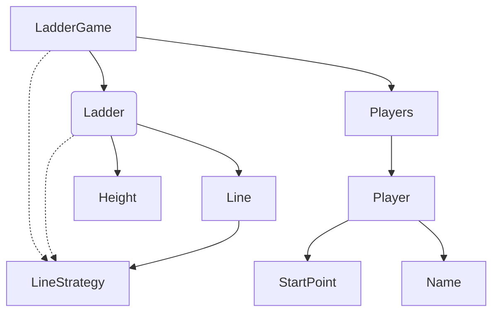

# java-ladder

사다리 타기 미션 저장소

## 우아한테크코스 코드리뷰

- [온라인 코드 리뷰 과정](https://github.com/woowacourse/woowacourse-docs/blob/master/maincourse/README.md)

## 설계 그래프

## 입력
- [x] 참여자 이름을 입력받는다.
  - [x] 이름은 쉼표로 구분되어 입력받는다.

- [x] 최대 사다리 높이를 입력받는다.
  - [x] 사다리 높이는 숫자가 아닌 문자이면 예외를 던진다.
  - [x] 입력받은 높이가 integer 최댓값을 넘기면 예외를 던진다.

- 실행결과를 입력 받는다.
  - 실행결과는 쉼표로 구분되어 입력받는다.
  - 실행결과의 개수는 참여자의 개수와 동일해야한다.
  - 실행결과 길이의 최댓값은 참여자 이름길이의 최댓값과 동일하다.
  
## 츌력
- [x] 이름과 사다리를 출력한다.
  - [x] 사다리의 폭은 이름의 최대 길이로 한다.

# 비즈니스 요구사항

## 플레이어
- [x] 플레이어 이름은 최소 1글자 최대 5글자이다.
- [x] 플레이어 이름이 빈 문자이면 예외를 던진다.
- [x] 중복된 이름이 입력되면 예외를 던진다.
### Position
- [x] 시작 위치는 0 이상이어야 한다.

## 사다리
- [x] 입력 받은 높이만큼 사다리 라인들을 생성한다.
- 실행결과를 계산한다.
  - 첫 층 라인에서 사다리를 따라 마지막 라인의 도칙점을 계산한다.
  - 마지막 라인의 도착점에 해당하는 실행결과를 반환한다.
### 사다리 높이 
- [x] 사다리 높이가 음수이면 예외를 던진다.
- [x] 최대 사다리 높이가 1 이하이면 예외를 던진다.
### 라인
- [x] 라인을 생성한다.
  - [x] 라인은 랜덤하게 생성한다.
  - [x] 연속으로 겹치지 않게 생성한다.
- [x] 시작점에서부터 라인을 따라 움직인 도착점을 계산한다.
  - [x] 라인의 범위를 벗어난 시작점에 대하서는 예외를 던진다. 
