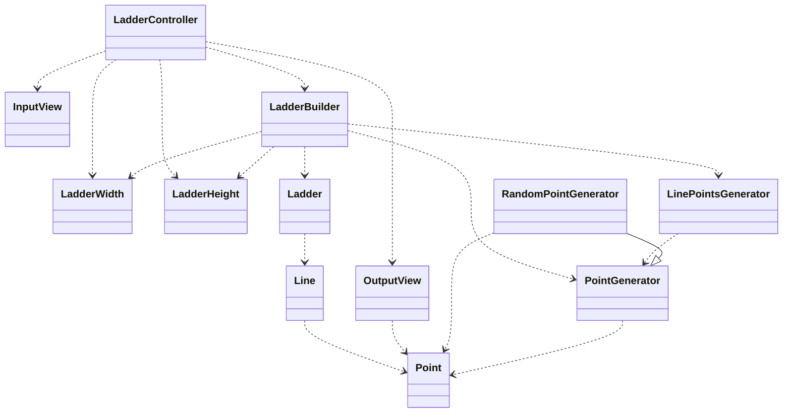

# 피드백

## 피드백을 위한 설계 설명

**LadderController**: 
- 유저에게 인풋을 받아옴
- LadderBuilder를 통해 Ladder 생성
- 생성된 Ladder 출력

**LadderBuilder**:
- width, heigth, PointGenerator로 사다리를 만들어 리턴

**Ladder**:
- Line을 리스트로 갖고 있는 일급 컬렉션

**Line**:
- Point를 리스트로 갖고 있는 일급 컬렉션

**LinePointsGenerator**:
- PointGenerator를 이용해 포인트가 연속되지 않게 포인트 리스트를 생성해주는 객체
- 예) RandomPointGenerator가 Point.presence를 생성시, 그 다음에 Point.absence를 리스트에 추가해줌

**PointsGenerator**:
- 포인트를 생성하는 메서드를 가진 **인터페이스**

**RandomPointGenerator**:
- 포인트를 랜덤으로 생성해주는 객체

**Point**:
- PRESENCE(true)
- ABSENCE(false)
- 를 갖고 있는 Enum 객체

## 피드백을 받을 부분

### Domain이 에러 메세지를 갖고 있어도 되는지
Domain 객체에서 검증을 하는경우, 에러 메세지를 상수로 가지고 있는게 자연스러운 것인지, 아니면 Enum 객체로 에러 메세지들을 빼서 가지고 있는게 자연스러운지 궁금합니다.

### Point Enum 객체를 도메인으로 봐야하는지
Point Enum 객체의 경우 제가 생각하기에는 도메인 로직을 담고 있는 것도 아니고, 별다른 상태를 갖고 있는것이 아니기 때문에, 제가 생각하기에는 도메인(모델)이 아니라서 View에서도 사용할 수 있다고 생각합니다. 그래서 View에서 사용하긴 했지만, 이게 모델에 의존한 상태는 아닌지 궁금하네요. 혹시 이런 Enum 객체를 뭐라고 표현해야하는지, View에서 Point Enum객체를 사용하는게 의존하는 것은 아닌지 궁금합니다.

### 이번 미션 일급 컬렉션의 경우 테스트를 추가해야하는지.
이번 미션의 경우 일급 컬렉션들이 자료를 갖고 있는 거 말고는 하는 일이 없어서 테스트를 추가하지 않았습니다. 나중에 일급 컬렉션들에 일들이 생기는 경우 필요하다고 생각이 되지만 지금 현재로써는 크게 필요 없다고 생각이 됩니다.